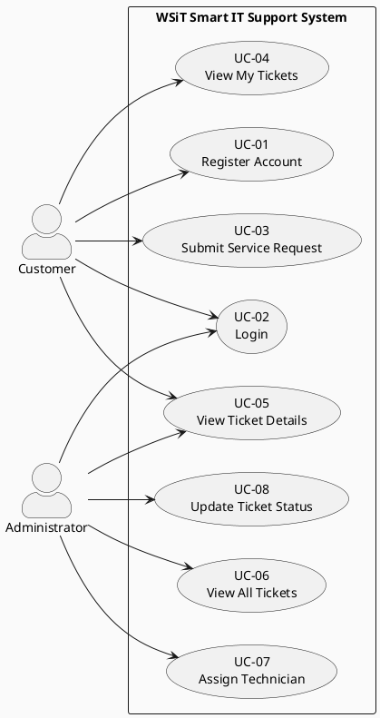
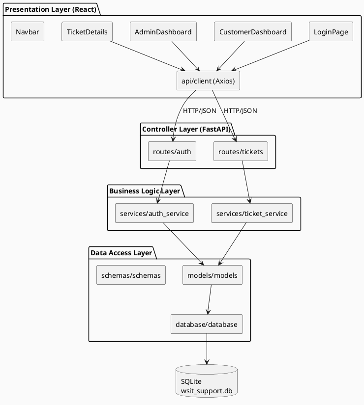
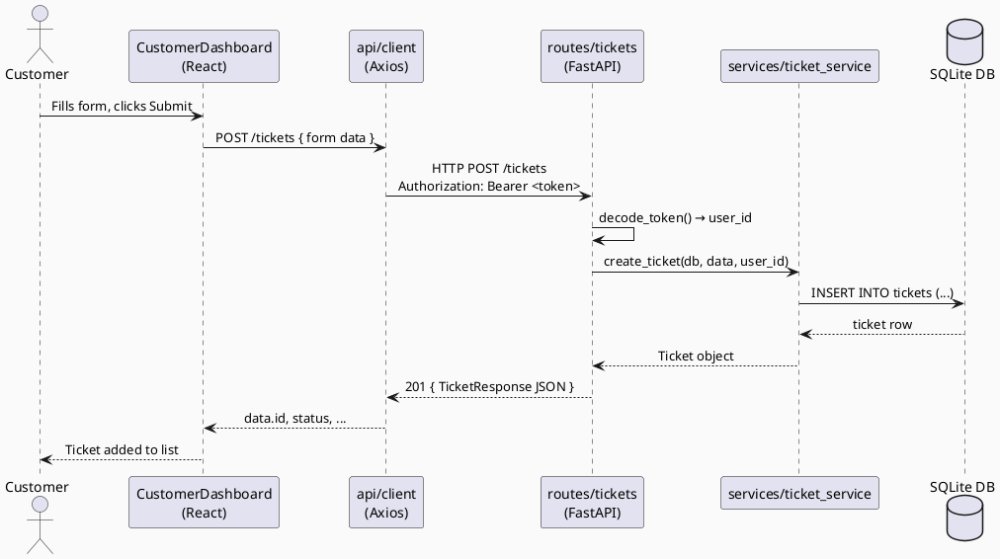
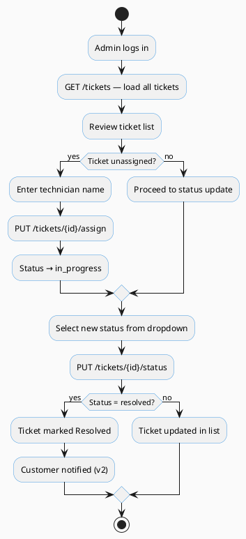
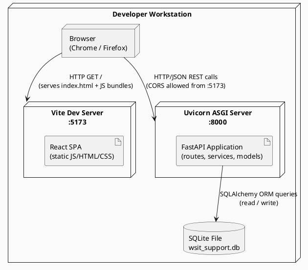

# Software Architecture Document (SAD) — Version 1.0
## Smart IT Service Request and Support Ticket System
### WSiT – World Systems for Information Technology

---

| Document Property | Value |
| :--- | :--- |
| Version | 1.0 (Phase 1 / MVP) |
| Date | 2026-05-05 |
| Status | Draft — Under Review |
| Architecture Style | Layered REST API Architecture |
| Document Format | 4+1 Architectural Model (Kruchten, 1995) |

---

## 1. Introduction

### 1.1 Purpose
This Software Architecture Document (SAD) describes the complete architectural design of the **Smart IT Service Request and Support Ticket System** for WSiT (World Systems for Information Technology). It serves as the primary technical reference for the development team, academic evaluators, and future maintainers of the system.

### 1.2 Scope
This document covers Phase 1 (MVP) of the system, which encompasses:
- Customer self-service ticket submission
- Role-based access for customers and administrators
- Technician assignment and ticket status management
- RESTful API backend powered by FastAPI and SQLite
- React-based single-page web application frontend

### 1.3 Target System
The system is deployed as a web application accessible via any modern browser. The backend exposes a JSON/HTTP REST API, consumed exclusively by the React frontend during Phase 1.

### 1.4 Architecture Style: Layered REST API
The system implements a **four-layer architecture** separating concerns across:

| Layer | Responsibility |
| :--- | :--- |
| **Presentation** | React SPA — renders UI, manages local state, calls API |
| **Controller (API)** | FastAPI route handlers — validates requests, delegates to services |
| **Business Logic** | Service modules — enforces rules, orchestrates data operations |
| **Data Access** | SQLAlchemy ORM — abstracts SQLite queries behind repository functions |

Communication between the frontend and backend is exclusively over **HTTP/JSON (REST)** using well-defined Pydantic schemas as contracts.

---

## 2. System Selection

### 2.1 System Name
**Smart IT Service Request and Support Ticket System**

### 2.2 Description
WSiT provides managed technology services across multiple verticals. Customers currently report issues via email and phone, resulting in untracked requests, missed SLAs, and poor visibility. This system replaces the informal process with a structured, digital ticketing workflow accessible 24/7.

### 2.3 System Users

| Actor | Description |
| :--- | :--- |
| **Customer** | An individual or organizational client who submits service requests and tracks ticket status |
| **Administrator** | A WSiT staff member who manages incoming tickets, assigns technicians, and updates ticket lifecycle |

### 2.4 Main Service Functionalities (Service Types)

| Service | Description |
| :--- | :--- |
| **CCTV** | Installation, maintenance, and troubleshooting of surveillance systems |
| **Networking** | LAN/WAN configuration, Wi-Fi setup, connectivity issues |
| **Maintenance** | General hardware and physical IT asset repair |
| **Smart Home** | IoT device installation and integration |
| **Access Control** | Biometric and card-based entry system support |
| **Tech Support** | General software, OS, and device troubleshooting |

---

## 3. 4+1 Architectural Model

### 3.1 Use Case View

#### 3.1.1 Actors
- **Customer** — submits requests, tracks tickets
- **Administrator** — manages the full ticket lifecycle

#### 3.1.2 Use Cases

| ID | Use Case | Actor | Description |
| :--- | :--- | :--- | :--- |
| UC-01 | Register Account | Customer | Create a new customer account |
| UC-02 | Login | Customer / Admin | Authenticate and receive session token |
| UC-03 | Submit Service Request | Customer | Create a new support ticket with service details |
| UC-04 | View My Tickets | Customer | List own submitted tickets with status |
| UC-05 | View Ticket Details | Customer / Admin | View full information on a single ticket |
| UC-06 | View All Tickets | Admin | See all tickets across all customers |
| UC-07 | Assign Technician | Admin | Assign a named technician to an open ticket |
| UC-08 | Update Ticket Status | Admin | Change ticket status (open → in_progress → resolved → closed) |

#### 3.1.3 Use Case Diagram



---

### 3.2 Logical View

#### 3.2.1 Layer Breakdown

**Presentation Layer (React SPA)**
- `LoginPage.jsx` — handles authentication and registration UI
- `CustomerDashboard.jsx` — ticket submission form and personal ticket list
- `AdminDashboard.jsx` — full ticket management with inline assign/status controls
- `TicketDetails.jsx` — read-only detail view for a single ticket
- `Navbar.jsx`, `StatusBadge.jsx` — reusable components
- `api/client.js` — centralised Axios instance with token injection

**Controller Layer (FastAPI Routes)**
- `routes/auth.py` — `POST /auth/login`, `POST /customers/register`
- `routes/tickets.py` — all ticket CRUD and management endpoints

**Business Logic Layer (Services)**
- `services/auth_service.py` — password hashing, token generation, admin seeding
- `services/ticket_service.py` — ticket creation, retrieval, status/assignment updates

**Data Access Layer (SQLAlchemy)**
- `models/models.py` — `User` and `Ticket` ORM entities
- `schemas/schemas.py` — Pydantic request/response contracts
- `database/database.py` — engine, session factory, `get_db` dependency

#### 3.2.2 Component Diagram



---

### 3.3 Process View

#### 3.3.1 Key Workflows

**Ticket Submission Flow:**
1. Customer fills out the service request form on `CustomerDashboard`
2. Axios POSTs to `POST /tickets` with `Authorization: Bearer <token>`
3. Route handler decodes token, retrieves user from DB
4. `ticket_service.create_ticket()` writes a new `Ticket` row (status = `open`)
5. Response returned and ticket appears in customer's ticket list

**Admin Ticket Management Flow:**
1. Admin logs in and lands on `AdminDashboard`
2. `GET /tickets` returns all tickets (admin-only)
3. Admin enters technician name and clicks **Assign** → `PUT /tickets/{id}/assign`
4. `ticket_service.assign_ticket()` sets `assigned_technician` and status = `in_progress`
5. Admin selects new status from dropdown and clicks **Save** → `PUT /tickets/{id}/status`

#### 3.3.2 Sequence Diagram — Customer Submits a Ticket



#### 3.3.3 Activity Diagram — Admin Ticket Management



---

### 3.4 Development View

#### 3.4.1 Module Organisation

```
smart-it-support-system/
├── backend/
│   ├── main.py                    # FastAPI app entry point, middleware, lifespan
│   ├── requirements.txt
│   └── app/
│       ├── database/
│       │   └── database.py        # SQLAlchemy engine, SessionLocal, Base, get_db
│       ├── models/
│       │   └── models.py          # User, Ticket ORM models + Enum definitions
│       ├── schemas/
│       │   └── schemas.py         # Pydantic request/response schemas
│       ├── routes/
│       │   ├── auth.py            # /auth/login, /customers/register
│       │   └── tickets.py         # All ticket endpoints + token decode helpers
│       └── services/
│           ├── auth_service.py    # Password hashing, mock token, admin seed
│           └── ticket_service.py  # Ticket CRUD business logic
│
├── frontend/
│   ├── index.html
│   ├── package.json
│   ├── vite.config.js
│   └── src/
│       ├── main.jsx               # ReactDOM mount point
│       ├── App.jsx                # React Router, route guards
│       ├── index.css              # Global styles
│       ├── api/
│       │   └── client.js          # Axios instance with Bearer token interceptor
│       ├── components/
│       │   ├── Navbar.jsx         # Top navigation bar with logout
│       │   └── StatusBadge.jsx    # Coloured badge for status/priority
│       └── pages/
│           ├── LoginPage.jsx      # Login + Register tabs
│           ├── CustomerDashboard.jsx
│           ├── AdminDashboard.jsx
│           └── TicketDetails.jsx
│
└── docs/
    └── SAD_V1.md                  # This document
```

#### 3.4.2 Dependency Summary

| Layer | Technology | Version |
| :--- | :--- | :--- |
| Frontend Framework | React | 18.3 |
| Frontend Build | Vite | 5.2 |
| HTTP Client | Axios | 1.7 |
| Frontend Routing | React Router | 6.23 |
| Backend Framework | FastAPI | 0.111 |
| ASGI Server | Uvicorn | 0.29 |
| ORM | SQLAlchemy | 2.0 |
| Validation | Pydantic | 2.7 |
| Database | SQLite | (bundled) |

---

### 3.5 Physical View

#### 3.5.1 Phase 1 Deployment (Local / Development)

All services run on a single developer machine. The browser communicates with the Vite dev server (port 5173) which serves the React SPA. All API calls are directed to the FastAPI/Uvicorn process on port 8000. FastAPI reads and writes to a SQLite file (`wsit_support.db`) on the local filesystem.

#### 3.5.2 Deployment Diagram



---

### 3.6 Scenarios (+1 View)

The following scenarios trace end-to-end system behaviour through the architectural layers.

#### Scenario 1 — Customer Submits a CCTV Service Request
1. Customer opens `http://localhost:5173`, lands on **LoginPage**.
2. Enters credentials → `POST /auth/login` → receives mock token + role = `customer`.
3. Token stored in `localStorage`; React Router navigates to `/dashboard`.
4. Customer clicks **+ New Request**, selects *CCTV*, fills form, submits.
5. `POST /tickets` hits FastAPI → token decoded → `ticket_service.create_ticket()` → `INSERT` into SQLite.
6. New ticket appears in the **My Service Requests** table with status `open`.

#### Scenario 2 — Admin Assigns a Technician
1. Admin logs in with `admin@wsit.com / admin123` → role = `admin` → navigated to `/admin`.
2. `GET /tickets` retrieves all tickets; table renders with ticket #1 status = `open`.
3. Admin types `"John Doe"` into the technician field for ticket #1 and clicks **Assign**.
4. `PUT /tickets/1/assign` → `ticket_service.assign_ticket()` → `assigned_technician = "John Doe"`, `status = "in_progress"`.
5. Table refreshes; ticket #1 now shows `in_progress` with technician `John Doe`.

#### Scenario 3 — Customer Tracks Ticket Status
1. Customer logs in and opens `/dashboard`.
2. `GET /tickets/my` returns own tickets including ticket #1.
3. Customer sees status changed from `open` to `in_progress`, assigned technician visible.
4. Customer clicks **View** → navigates to `/tickets/1` → `TicketDetails` page shows all metadata.

---

## 4. Phase 1 Implementation Notes

### 4.1 MVP Features (Phase 1)

| Feature | Status |
| :--- | :--- |
| Customer registration & login | ✅ Implemented |
| Role-based route protection (customer / admin) | ✅ Implemented |
| Ticket submission with service type, priority, location | ✅ Implemented |
| Customer "My Tickets" view | ✅ Implemented |
| Admin "All Tickets" view | ✅ Implemented |
| Technician assignment | ✅ Implemented |
| Ticket status management | ✅ Implemented |
| Ticket detail view | ✅ Implemented |
| Admin seed account | ✅ Implemented |

### 4.2 Planned Version 2 Enhancements

| Enhancement | Rationale |
| :--- | :--- |
| JWT-based authentication (replace mock token) | Security hardening for production |
| Password hashing with bcrypt | Replaces SHA-256 prototype hash |
| Email notifications on ticket updates | Improves customer communication |
| SLA tracking and escalation rules | Business priority management |
| File/image attachments on tickets | Richer problem reporting |
| Reporting dashboard with charts | Management visibility |
| Pagination and search on ticket lists | Performance at scale |
| Containerization (Docker Compose) | Reproducible deployment |
| Role expansion: Technician role | More granular access control |

---

## 5. Team Member Contributions

| Team Member | Project Role / Responsibility | Contribution |
| :--- | :--- | :--- |
| Zekeriya | Lead Software Architect / Backend | Defined logical architecture, FastAPI setup, database schema, SAD drafting |
| Hussein | Frontend Developer | React component architecture, UI implementation |
| Hamza | Systems Analyst | Requirements gathering, Use Case definitions, PlantUML diagrams |
| Elsa | API & Integration Specialist | REST endpoint design, frontend-backend integration |
| Leen | QA & Technical Writer | System process workflows, formatting, Phase 1 testing |

---

## 6. Conclusion

The Smart IT Service Request and Support Ticket System for WSiT provides a clean, extensible foundation for digitising IT service operations. By applying a **Layered REST API Architecture** and documenting it through the **4+1 Architectural Model**, the system achieves clear separation of concerns, straightforward testability, and a well-understood contract between the frontend and backend.

Phase 1 delivers a functional MVP covering the full ticket lifecycle — from customer submission through admin assignment to resolution — on a local development stack. The architecture is deliberately conservative: SQLite and a mock token scheme keep the barrier to entry low while the codebase structure makes upgrading to PostgreSQL, JWT auth, and a cloud deployment a matter of configuration rather than re-architecture.

The 4+1 views collectively demonstrate how the system satisfies its stakeholder concerns: the Use Case View validates functional completeness, the Logical View ensures maintainability, the Process View captures runtime behaviour, the Development View guides implementation, and the Physical View reflects the deployment reality. Together they constitute a robust architectural baseline from which Version 2 enhancements can be planned and executed with confidence.
