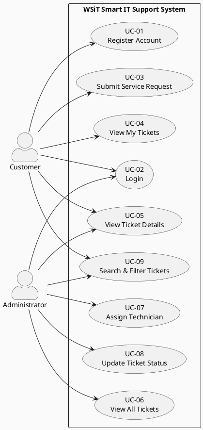
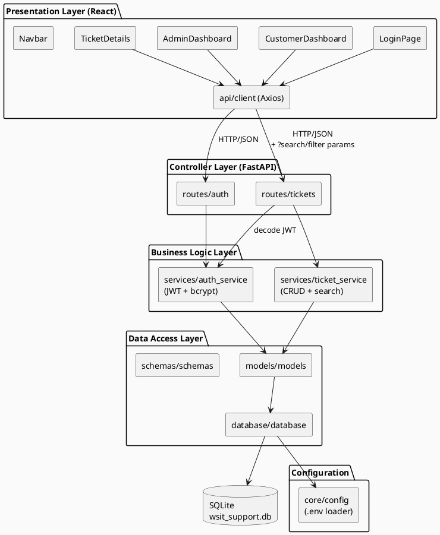
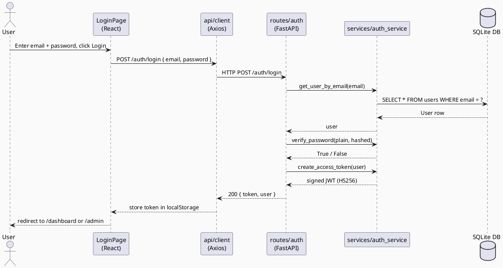
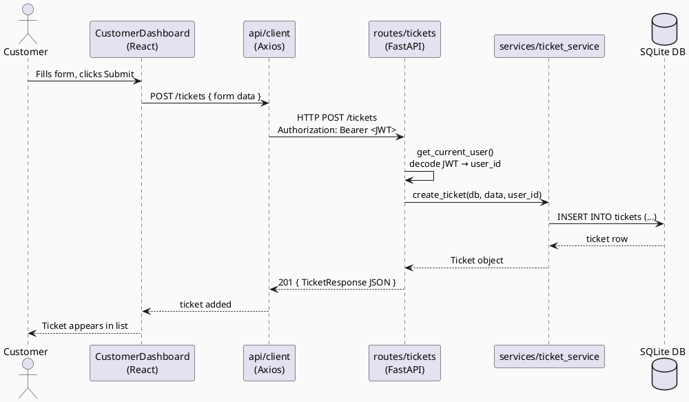
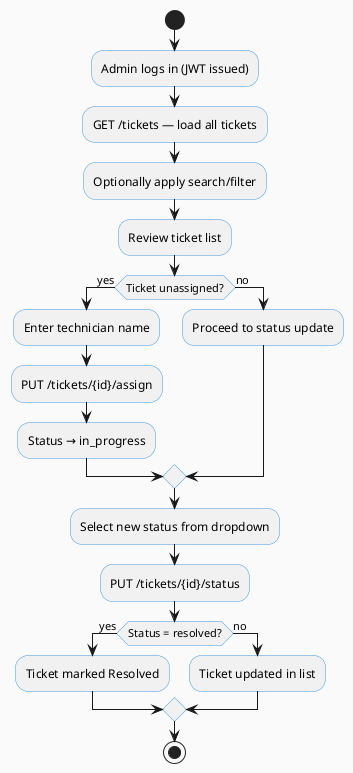
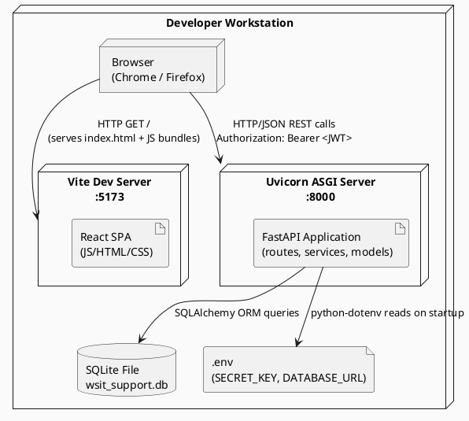
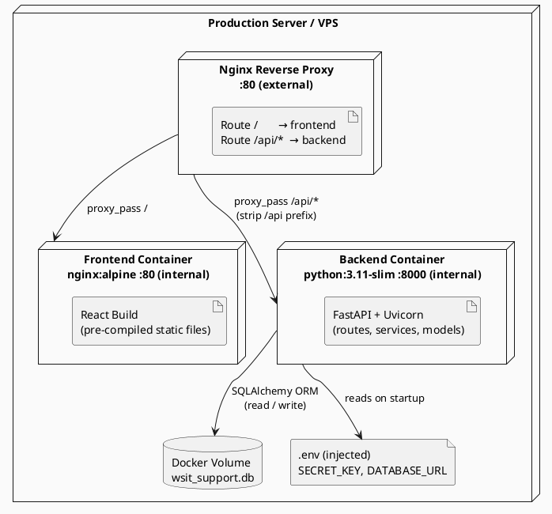

# Software Architecture Document (SAD) — Version 2.0
## Smart IT Service Request and Support Ticket System
### WSiT – World Systems for Information Technology

---

| Document Property | Value |
| :--- | :--- |
| Version | 2.0 (Phase 2) |
| Previous Version | 1.0 (Phase 1 / MVP) |
| Date | 2026-05-19 |
| Status | Final |
| Architecture Style | Layered REST API Architecture |
| Document Format | 4+1 Architectural Model (Kruchten, 1995) |

---

## Change Log

| Version | Date | Changes |
| :--- | :--- | :--- |
| 1.0 | 2026-05-05 | Initial MVP — mock token auth, SHA-256 hashing, basic ticket CRUD |
| 2.0 | 2026-05-19 | JWT authentication, bcrypt hashing, search/filter, .env configuration, Docker support, production deployment view |

---

## 1. Introduction

### 1.1 Purpose
This Software Architecture Document (SAD) describes the complete architectural design of the **Smart IT Service Request and Support Ticket System** for WSiT (World Systems for Information Technology). Version 2.0 extends the Phase 1 MVP baseline by introducing production-ready security, search capabilities, deployment configuration, and a formal Production Deployment View.

### 1.2 Scope
This document covers Phase 2 of the system, which builds directly on Phase 1 and adds:
- JWT-based authentication replacing the Phase 1 mock token
- bcrypt password hashing replacing SHA-256
- Ticket search and filter by status, priority, and keyword
- Environment-based configuration via `.env` files
- Docker containerisation support
- Production deployment architecture with Nginx reverse proxy

All Phase 1 functionality is preserved and extended. No architectural redesign was performed.

### 1.3 Target System
The system is deployed as a web application accessible via any modern browser. The backend exposes a JSON/HTTP REST API consumed exclusively by the React frontend. In production, Nginx serves as a reverse proxy routing browser traffic to either the frontend static files or the backend API.

### 1.4 Architecture Style: Layered REST API
The system maintains the same **four-layer architecture** from Phase 1:

| Layer | Responsibility |
| :--- | :--- |
| **Presentation** | React SPA — renders UI, manages local state, calls API |
| **Controller (API)** | FastAPI route handlers — validates requests, delegates to services |
| **Business Logic** | Service modules — enforces rules, orchestrates data operations |
| **Data Access** | SQLAlchemy ORM — abstracts SQLite queries behind repository functions |

Communication between the frontend and backend is exclusively over **HTTP/JSON (REST)** using Pydantic schemas as contracts. JWTs are signed with HS256 and passed as `Authorization: Bearer <token>` headers.

---

## 2. System Selection

### 2.1 System Name
**Smart IT Service Request and Support Ticket System**

### 2.2 Description
WSiT provides managed technology services across multiple verticals. This system replaces informal email/phone-based IT request tracking with a structured, digital ticketing workflow accessible 24/7. Phase 2 adds the security and deployment hardening necessary for real-world operation.

### 2.3 System Users

| Actor | Description |
| :--- | :--- |
| **Customer** | An individual or organizational client who submits service requests and tracks ticket status |
| **Administrator** | A WSiT staff member who manages incoming tickets, assigns technicians, and updates ticket lifecycle |

### 2.4 Main Service Functionalities

| Service | Description |
| :--- | :--- |
| **CCTV** | Installation, maintenance, and troubleshooting of surveillance systems |
| **Networking** | LAN/WAN configuration, Wi-Fi setup, connectivity issues |
| **Maintenance** | General hardware and physical IT asset repair |
| **Smart Home** | IoT device installation and integration |
| **Access Control** | Biometric and card-based entry system support |
| **Tech Support** | General software, OS, and device troubleshooting |

---

## 3. 4+1 Architectural Model

### 3.1 Use Case View

#### 3.1.1 Actors
- **Customer** — submits requests, filters and tracks own tickets
- **Administrator** — manages the full ticket lifecycle, searches across all tickets

#### 3.1.2 Use Cases

| ID | Use Case | Actor | Phase | Description |
| :--- | :--- | :--- | :--- | :--- |
| UC-01 | Register Account | Customer | 1 | Create a new customer account |
| UC-02 | Login | Customer / Admin | 1 | Authenticate and receive JWT |
| UC-03 | Submit Service Request | Customer | 1 | Create a new ticket with service details and priority |
| UC-04 | View My Tickets | Customer | 1 | List own submitted tickets with status |
| UC-05 | View Ticket Details | Customer / Admin | 1 | View full information on a single ticket |
| UC-06 | View All Tickets | Admin | 1 | See all tickets across all customers |
| UC-07 | Assign Technician | Admin | 1 | Assign a named technician to an open ticket |
| UC-08 | Update Ticket Status | Admin | 1 | Change ticket status through the lifecycle |
| UC-09 | Search & Filter Tickets | Customer / Admin | 2 | Filter tickets by status, priority, or keyword |

#### 3.1.3 Use Case Diagram



---

### 3.2 Logical View

#### 3.2.1 Layer Breakdown

**Presentation Layer (React SPA)**
- `LoginPage.jsx` — authentication and registration UI with loading/error states
- `CustomerDashboard.jsx` — ticket submission form, filter bar, personal ticket list
- `AdminDashboard.jsx` — full ticket management with search/filter, inline assign/status controls
- `TicketDetails.jsx` — read-only detail view for a single ticket
- `Navbar.jsx`, `StatusBadge.jsx` — reusable UI components
- `api/client.js` — centralised Axios instance with JWT Bearer token injection and `VITE_API_URL` configuration

**Controller Layer (FastAPI Routes)**
- `routes/auth.py` — `POST /auth/login` (issues JWT), `POST /customers/register`
- `routes/tickets.py` — all ticket CRUD endpoints; JWT decode dependency; optional `?status`, `?priority`, `?search` query parameters

**Business Logic Layer (Services)**
- `services/auth_service.py` — bcrypt hashing, JWT creation/decoding, admin seeding
- `services/ticket_service.py` — ticket CRUD, `_apply_filters()` helper for search/filter queries

**Data Access Layer (SQLAlchemy)**
- `models/models.py` — `User` and `Ticket` ORM entities, `TicketPriority`, `TicketStatus`, `ServiceType` enums
- `schemas/schemas.py` — Pydantic request/response contracts
- `database/database.py` — engine, session factory, `get_db` dependency (reads `DATABASE_URL` from config)

**Configuration**
- `app/core/config.py` — loads `SECRET_KEY`, `ALGORITHM`, `ACCESS_TOKEN_EXPIRE_MINUTES`, `DATABASE_URL` from `.env` via `python-dotenv`

#### 3.2.2 Component Diagram



---

### 3.3 Process View

#### 3.3.1 Key Workflows

**JWT Login Flow (Phase 2):**
1. Customer submits email + password to `POST /auth/login`
2. `auth_service.verify_password()` checks bcrypt hash stored in DB
3. On success, `auth_service.create_access_token()` generates a signed HS256 JWT
4. Token payload contains `sub` (user ID), `email`, `role`, `exp` (expiry)
5. Frontend stores JWT in `localStorage`; Axios interceptor attaches it as `Authorization: Bearer <token>` on every subsequent request

**Ticket Submission Flow:**
1. Customer fills the service request form on `CustomerDashboard`
2. Axios POSTs to `POST /tickets` with `Authorization: Bearer <JWT>`
3. `get_current_user()` dependency decodes JWT, retrieves user by `sub` (ID) from DB
4. `ticket_service.create_ticket()` writes a new `Ticket` row (status = `open`)
5. Response returned; ticket appears in customer's filtered ticket list

**Ticket Search/Filter Flow:**
1. User sets filters (status, priority) or enters a search term in the UI
2. Frontend calls `GET /tickets?status=open&priority=high&search=floor`
3. `ticket_service._apply_filters()` applies `WHERE` clauses to the SQLAlchemy query
4. Filtered list returned and rendered in the table

#### 3.3.2 Sequence Diagram — JWT Login



#### 3.3.3 Sequence Diagram — Customer Submits a Ticket



#### 3.3.4 Activity Diagram — Admin Ticket Management



---

### 3.4 Development View

#### 3.4.1 Module Organisation

```
smart-it-support-system/
├── backend/
│   ├── main.py                     # FastAPI app, CORS, lifespan v2.0.0
│   ├── requirements.txt            # + python-jose, passlib[bcrypt], python-dotenv
│   ├── Dockerfile                  # Python 3.11-slim image
│   ├── .env                        # Local secrets (not committed)
│   ├── .env.example                # Template for new developers
│   └── app/
│       ├── core/
│       │   └── config.py           # Loads SECRET_KEY, ALGORITHM, DATABASE_URL from .env
│       ├── database/
│       │   └── database.py         # Engine reads DATABASE_URL from config
│       ├── models/
│       │   └── models.py           # User, Ticket ORM models + Enum definitions
│       ├── schemas/
│       │   └── schemas.py          # Pydantic request/response schemas
│       ├── routes/
│       │   ├── auth.py             # /auth/login (JWT), /customers/register
│       │   └── tickets.py          # All ticket endpoints + JWT auth deps + filter params
│       └── services/
│           ├── auth_service.py     # bcrypt hashing, JWT create/decode, admin seed
│           └── ticket_service.py   # Ticket CRUD + _apply_filters() search/filter
│
├── frontend/
│   ├── index.html
│   ├── package.json
│   ├── vite.config.js
│   ├── Dockerfile                  # Multi-stage: node build → nginx serve
│   ├── nginx.conf                  # SPA fallback for React Router
│   ├── .env                        # VITE_API_URL (not committed)
│   ├── .env.example
│   └── src/
│       ├── main.jsx
│       ├── App.jsx                 # React Router + RequireAuth guards
│       ├── index.css               # Global styles + badge colours
│       ├── api/
│       │   └── client.js           # Axios + Bearer token + VITE_API_URL
│       ├── components/
│       │   ├── Navbar.jsx
│       │   └── StatusBadge.jsx
│       └── pages/
│           ├── LoginPage.jsx       # Login + Register tabs, loading/error states
│           ├── CustomerDashboard.jsx  # Submit form + filter bar + ticket list
│           ├── AdminDashboard.jsx     # Search/filter bar + full ticket management
│           └── TicketDetails.jsx      # Single ticket read-only view
│
├── docs/
│   ├── SAD_V1.md                   # Phase 1 architecture document
│   └── SAD_V2.md                   # This document
├── docker-compose.yml              # Runs backend + frontend together
└── README.md                       # Setup instructions for both phases
```

#### 3.4.2 Dependency Summary

| Layer | Technology | Version | Notes |
| :--- | :--- | :--- | :--- |
| Frontend Framework | React | 18.3 | |
| Frontend Build | Vite | 5.2 | Reads `VITE_*` env at build time |
| HTTP Client | Axios | 1.7 | Bearer token injected via interceptor |
| Frontend Routing | React Router | 6.23 | `RequireAuth` guards per role |
| Backend Framework | FastAPI | 0.104 | |
| ASGI Server | Uvicorn | 0.24 | |
| ORM | SQLAlchemy | 2.0 | |
| Validation | Pydantic | 2.7 | |
| JWT | python-jose | 3.3 | HS256 signing (**Phase 2**) |
| Password Hashing | passlib[bcrypt] | 1.7 | bcrypt rounds (**Phase 2**) |
| Env Config | python-dotenv | 1.0 | `.env` file loading (**Phase 2**) |
| Database | SQLite | bundled | Single-file, no separate server |
| Container Runtime | Docker / Compose | — | Optional (**Phase 2**) |

#### 3.4.3 Security Architecture (Phase 2)

| Concern | Implementation |
| :--- | :--- |
| **Password storage** | bcrypt via `passlib` — each hash includes a unique salt |
| **Authentication tokens** | HS256 JWT — signed with `SECRET_KEY`, payload includes user ID, role, expiry |
| **Token transport** | `Authorization: Bearer <token>` HTTP header; never in query strings |
| **Token expiry** | Configurable via `ACCESS_TOKEN_EXPIRE_MINUTES` (default: 1440 min / 24 h) |
| **Role enforcement** | `require_admin` FastAPI dependency — raises HTTP 403 if role ≠ admin |
| **CORS** | Restricted to `http://localhost:5173` and `http://localhost:3000` |
| **Secrets management** | All secrets in `.env` — `.env.example` provided, `.env` excluded from version control |

---

### 3.5 Physical View

#### 3.5.1 Development Deployment (Local)

All services run on a single developer machine. The browser communicates with the Vite dev server (port 5173) which serves the React SPA. All API calls are directed to FastAPI/Uvicorn on port 8000. FastAPI reads and writes to a SQLite file on the local filesystem. Environment variables are loaded from `backend/.env`.

#### 3.5.2 Development Deployment Diagram



#### 3.5.3 Production Deployment (Docker + Nginx)

In production, the system is containerised with Docker. The React application is built into static files and served by Nginx. FastAPI runs behind Uvicorn inside a Python container. An Nginx reverse proxy acts as the single entry point: static assets are served directly while API requests (`/api/*`) are proxied to the FastAPI container.

**Deployment topology:**

| Component | Container | Port | Responsibility |
| :--- | :--- | :--- | :--- |
| Nginx reverse proxy | `nginx:alpine` | 80 (external) | Route requests: `/` → frontend, `/api/` → backend |
| React frontend | `node:18 → nginx:alpine` | 80 (internal) | Serve pre-built static SPA files |
| FastAPI backend | `python:3.11-slim` | 8000 (internal) | Handle REST API requests |
| SQLite | Volume mount | — | Persist ticket and user data |

#### 3.5.4 Production Deployment Diagram



#### 3.5.5 Optional Nginx Reverse Proxy Configuration

For reference, the following Nginx configuration demonstrates how a reverse proxy container routes traffic in the production topology described above:

```nginx
server {
    listen 80;
    server_name _;

    # Serve the React SPA
    location / {
        proxy_pass         http://frontend:80;
        proxy_set_header   Host $host;
    }

    # Proxy API calls to FastAPI (strips /api prefix)
    location /api/ {
        rewrite ^/api/(.*) /$1 break;
        proxy_pass         http://backend:8000;
        proxy_set_header   Host $host;
        proxy_set_header   X-Real-IP $remote_addr;
    }
}
```

---

### 3.6 Scenarios (+1 View)

The following scenarios trace end-to-end system behaviour through the architectural layers.

#### Scenario 1 — Customer Logs In with JWT (Phase 2)
1. Customer opens `http://localhost:5173`, lands on **LoginPage**.
2. Enters credentials → `POST /auth/login`.
3. `auth_service.verify_password()` checks bcrypt hash in DB.
4. `auth_service.create_access_token()` returns a signed HS256 JWT (24 h TTL).
5. Frontend stores JWT in `localStorage`; React Router navigates to `/dashboard`.
6. All subsequent API calls attach `Authorization: Bearer <JWT>` via the Axios interceptor.

#### Scenario 2 — Customer Submits a CCTV Service Request
1. Customer clicks **+ New Request** on `CustomerDashboard`.
2. Fills service type (`CCTV`), priority (`high`), title, location, description.
3. `POST /tickets` → `get_current_user()` decodes JWT → `ticket_service.create_ticket()` → `INSERT` into SQLite.
4. New ticket appears in the **My Service Requests** table with status `open`.

#### Scenario 3 — Admin Searches and Assigns a Technician
1. Admin logs in → `/admin` dashboard loads all tickets.
2. Admin types "CCTV" in the search box and selects Status = `open` → clicks **Filter**.
3. `GET /tickets?search=CCTV&status=open` → `_apply_filters()` applies `ilike` and `WHERE` → filtered list returned.
4. Admin types `"John Doe"` into the technician field for ticket #1 → clicks **Assign**.
5. `PUT /tickets/1/assign` → `assigned_technician = "John Doe"`, `status = "in_progress"`.
6. Table refreshes; ticket #1 shows `in_progress` with technician `John Doe`.

#### Scenario 4 — Customer Tracks Ticket Status
1. Customer logs in, opens `/dashboard`, applies filter Status = `in_progress`.
2. `GET /tickets/my?status=in_progress` → filtered list of own tickets.
3. Customer sees ticket #1 with technician `John Doe` and status `in_progress`.
4. Customer clicks **View** → `TicketDetails` page shows all metadata and description.

---

## 4. Implementation Summary

### 4.1 Phase 1 Features

| Feature | Status |
| :--- | :--- |
| Customer registration and login | ✅ Complete |
| Role-based route protection (customer / admin) | ✅ Complete |
| Ticket submission with service type, priority, location | ✅ Complete |
| Customer "My Tickets" view | ✅ Complete |
| Admin "All Tickets" view | ✅ Complete |
| Technician assignment | ✅ Complete |
| Ticket status management | ✅ Complete |
| Ticket detail view | ✅ Complete |
| Admin seed account | ✅ Complete |

### 4.2 Phase 2 Features

| Feature | Status |
| :--- | :--- |
| JWT-based authentication (replaces mock token) | ✅ Complete |
| bcrypt password hashing (replaces SHA-256) | ✅ Complete |
| Ticket search by keyword (title, description, location) | ✅ Complete |
| Ticket filter by status and priority | ✅ Complete |
| `.env` configuration (backend + frontend) | ✅ Complete |
| Loading states in all dashboard views | ✅ Complete |
| Protected routes with role-based redirection | ✅ Complete |
| Form validation with error messages | ✅ Complete |
| README with setup instructions | ✅ Complete |
| Docker support (Dockerfile + docker-compose) | ✅ Complete |
| Production deployment diagram | ✅ Complete |
| SAD Version 2 | ✅ Complete |

---

## 5. Team Member Contributions

| Team Member | Project Role / Responsibility | Contribution |
| :--- | :--- | :--- |
| Zekeriya | Lead Software Architect / Backend | Phase 2 security design, JWT/bcrypt migration, SAD V2 architecture sections |
| Hussein | Frontend Developer | Search/filter UI, loading states, Docker frontend configuration |
| Hamza | Systems Analyst | UC-09 use case extension, updated PlantUML diagrams, SAD V2 review |
| Elsa | API & Integration Specialist | Filter query params, backend/frontend integration for search, .env setup |
| Leen | QA & Technical Writer | Phase 2 testing, README V2, deployment documentation |

---

## 6. Conclusion

Version 2.0 of the Smart IT Service Request and Support Ticket System delivers a production-hardened extension of the Phase 1 MVP. The core **Layered REST API Architecture** is preserved unchanged; all Phase 2 improvements are additive rather than structural.

The key security upgrades — JWT-based authentication and bcrypt password hashing — replace the prototype mechanisms from Phase 1 with industry-standard approaches suitable for deployment. Environment-based configuration via `.env` files decouples secrets from source code, while Docker support enables reproducible builds and simplified deployment.

The search and filter capability added in Phase 2 demonstrates how the layered architecture cleanly accommodates new query behaviour: the filter logic is encapsulated in `ticket_service._apply_filters()` and exposed through optional query parameters in the route layer, with no changes required to the data model or the frontend component structure.

The Production Deployment View introduced in this document extends the Physical View to cover the containerised production topology, showing how Nginx, FastAPI/Uvicorn, and the React SPA interact behind a reverse proxy. Together, the six 4+1 views — Use Case, Logical, Process, Development, Physical, and Scenarios — provide a complete architectural picture suitable for both academic evaluation and practical team reference.
